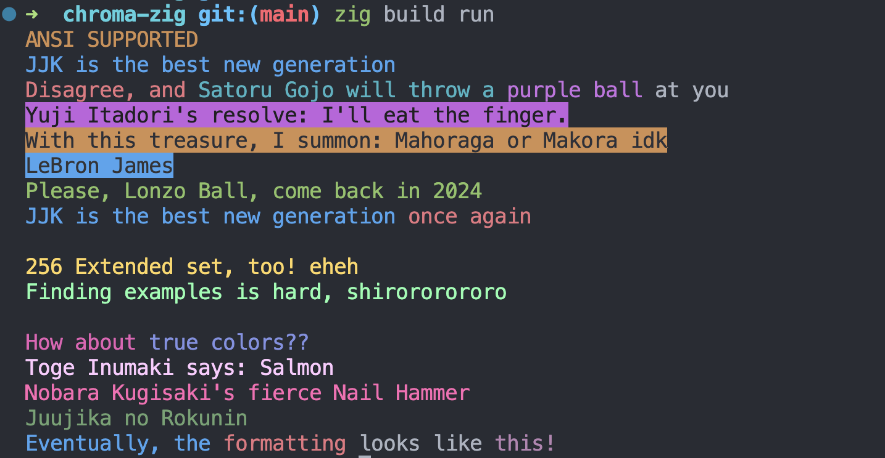

# Chroma

Chroma is a Zig library that provides flexible and dynamic string formatting with ANSI color codes. It supports standard ANSI colors, ANSI 256 extended colors, and true color (24-bit) formats, allowing for colorful terminal output with ease.

# NOTE-test

> [!NOTE]
> Chroma is currently in development and may not be fully functional. Please refer to the repository for the latest updates and information. It currently only support compile-time formatting. So make sure to use it in a compile-time context.



## Table of Contents

- [Introduction](#introduction)
- [Installation](#installation)
- [Usage](#usage)
- [Features](#features)
- [Dependencies](#dependencies)
- [Configuration](#configuration)
- [Documentation](#documentation)
- [Examples](#examples)
- [Troubleshooting](#troubleshooting)
- [Contributors](#contributors)
- [License](#license)

## Introduction

This project aims to enhance terminal applications by enabling developers to use colors in their output more expressively and flexibly. With Chroma, you can easily format your strings with color by including color names or RGB values in curly braces within the text.

## Installation

Chroma requires Zig version 0.12.0-dev.2701+d18f52197 or newer. You can include it in your Zig project by adding it as a package in your `build.zig` file:

1. Fetch the project using `zig fetch` (recommended !)

```bash
zig fetch --save https://github.com/adia-dev/chroma-zig/archive/refs/tags/v0.1.0.tar.gz
```

Or manually paste this in your `build.zig.zon`

```zig
.dependencies = .{
    // other deps...
    .chroma = .{
        .url = "https://github.com/adia-dev/chroma-zig/archive/refs/tags/v0.1.1.tar.gz",
        .hash = "<HASH_OF_THE_RELEASE>",
    },
    // ...
},
```

Note that if you do not know the hash of the release, zig will spit it out as an error in the console.

2. In your `build.zig`, add Chroma as a module:

```zig
// Add the chroma dep
const chroma = b.dependency("chroma", .{});
// Adding the module to the executable
exe.root_module.addImport("chroma", chroma.module("chroma"));
```

3. Use `zig build` to compile your project.

## Usage

To use Chroma in your application, import the library and call the `format` function with your format string and arguments:

```zig
const std = @import("std");
const chroma = @import("lib.zig");

pub fn main() !void {
    const examples = [_]struct { fmt: []const u8, arg: ?[]const u8 }{
        // Basic color and style
        .{ .fmt = "{bold,red}Bold and Red{reset}", .arg = null },
        // Combining background and foreground with styles
        .{ .fmt = "{fg:cyan,bg:magenta}{underline}Cyan on Magenta underline{reset}", .arg = null },
        // Nested styles and colors
        .{ .fmt = "{green}Green {bold}and Bold{reset,blue,italic} to blue italic{reset}", .arg = null },
        // Extended ANSI color with arg example
        .{ .fmt = "{bg:120}Extended ANSI {s}{reset}", .arg = "Background" },
        // True color specification
        .{ .fmt = "{fg:255;100;0}True Color Orange Text{reset}", .arg = null },
        // Mixed color and style formats
        .{ .fmt = "{bg:28,italic}{fg:231}Mixed Background and Italic{reset}", .arg = null },
        // Unsupported/Invalid color code >= 256, Error thrown at compile time
        // .{ .fmt = "{fg:999}This should not crash{reset}", .arg = null },
        // Demonstrating blink, note: may not be supported in all terminals
        .{ .fmt = "{blink}Blinking Text (if supported){reset}", .arg = null },
        // Using dim and reverse video
        .{ .fmt = "{dim,reverse}Dim and Reversed{reset}", .arg = null },
        // Custom message with dynamic content
        .{ .fmt = "{blue,bg:magenta}User {bold}{s}{reset,0;255;0} logged in successfully.", .arg = "Charlie" },
        // Combining multiple styles and reset
        .{ .fmt = "{underline,cyan}Underlined Cyan{reset} then normal", .arg = null },
        // Multiple format specifiers for complex formatting
        .{ .fmt = "{fg:144,bg:52,bold,italic}Fancy {underline}Styling{reset}", .arg = null },
        // Jujutsu Kaisen !!
        .{ .fmt = "{bg:72,bold,italic}Jujutsu Kaisen !!{reset}", .arg = null },
    };

    inline for (examples) |example| {
        if (example.arg) |arg| {
            std.debug.print(chroma.format(example.fmt) ++ "\n", .{arg});
        } else {
            std.debug.print(chroma.format(example.fmt) ++ "\n", .{});
        }
    }

    std.debug.print(chroma.format("{blue}{underline}Eventually{reset}, the {red}formatting{reset} looks like {130;43;122}{s}!\n"), .{"this"});
}

```

## Features

- **Standard ANSI Colors**: Easily use standard ANSI colors in your strings.
- **ANSI 256 Colors**: Utilize the extended set of 256 colors for more detailed color output.
- **True Colors**: Use true color (24-bit) RGB values for precise color representation.
- **Flexible Formatting**: Combine colors, reset styles, and include text dynamically within your format strings.
- **Compile-Time Checks**: The format function is evaluated at compile-time, ensuring that your color format strings are valid.

## Dependencies

Chroma does not currently have any external dependencies beyond the Zig standard library.

## Configuration

No additional configuration is required to use Chroma in your Zig projects.

## Documentation

For detailed documentation on available colors and usage patterns, refer to the source files in the `src` directory. The main API is provided through `src/lib.zig`, with utility functions and ANSI color definitions located in `src/utils.zig` and `src/ansi.zig`, respectively.

## Examples

You can find an example of how to [use Chroma](https://github.com/adia-dev/use-chroma-zig) in this repository.

## Troubleshooting

If you encounter any issues with compiling or using Chroma, ensure you are using a compatible Zig version. For further assistance, consult the Zig community resources or submit an issue on the Chroma GitHub repository.

## Contributors

Contributions to Chroma are welcome! If you would like to contribute, please submit a pull request or issue on GitHub.

## License

Chroma is open-source software licensed under the MIT license. For more details, see the LICENSE file in the repository.
