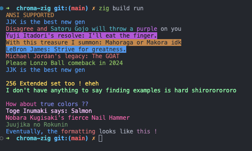

# Chroma-Zig

Chroma-Zig is a Zig library that provides flexible and dynamic string formatting with ANSI color codes. It supports standard ANSI colors, ANSI 256 extended colors, and true color (24-bit) formats, allowing for colorful terminal output with ease.



## Table of Contents

- [Introduction](#introduction)
- [Installation](#installation)
- [Usage](#usage)
- [Features](#features)
- [Dependencies](#dependencies)
- [Configuration](#configuration)
- [Documentation](#documentation)
- [Examples](#examples)
- [Troubleshooting](#troubleshooting)
- [Contributors](#contributors)
- [License](#license)

## Introduction

This project aims to enhance terminal applications by enabling developers to use colors in their output more expressively and flexibly. With Chroma-Zig, you can easily format your strings with color by including color names or RGB values in curly braces within the text.

## Installation

Chroma-Zig requires Zig version 0.12.0-dev.2701+d18f52197 or newer. You can include it in your Zig project by adding it as a package in your `build.zig` file:

1. Clone the Chroma-Zig repository to your local machine.
2. In your `build.zig`, add Chroma-Zig as a package:

   ```zig
   const chroma_zig = @import("path/to/chroma-zig/build.zig");

   pub fn build(b: *std.build.Builder) void {
       ...
       const pkg = b.addPackagePath("chroma-zig", "path/to/chroma-zig/src/lib.zig");
       exe.addPackage(pkg);
       ...
   }
   ```

3. Use `zig build` to compile your project.

## Usage

To use Chroma-Zig in your application, import the library and call the `format` function with your format string and arguments:

```zig
const std = @import("std");
const chroma = @import("lib.zig");

pub fn main() !void {
    const examples = [_]struct { fmt: []const u8, arg: []const u8 }{
        // Ansi fg and bg
        .{ .fmt = "{yellow}ANSI {s}", .arg = "SUPPORTED" },
        .{ .fmt = "{blue}JJK is the best new {s}", .arg = "gen" },
        .{ .fmt = "{red}Disagree and {cyan}Satoru Gojo will throw a {magenta}{s}{reset} on you", .arg = "purple" },
        .{ .fmt = "{bgMagenta}{white}Yuji Itadori's resolve: {s}", .arg = "I'll eat the finger." },
        .{ .fmt = "{bgYellow}{black}With this treasure I summon: {s}", .arg = "Mahoraga or Makora idk" },
        .{ .fmt = "{bgBlue}{white}LeBron James: {s}", .arg = "Strive for greatness." },
        .{ .fmt = "{red}Michael Jordan's legacy: {s}", .arg = "The GOAT" },
        .{ .fmt = "{green}Please Lonzo Ball comeback in {s}", .arg = "2024" },
        .{ .fmt = "{blue}JJK is the best new {s}", .arg = "gen" },

        // Ansi 256 extended
        .{ .fmt = "\n{221}256 Extended set too ! {s}", .arg = "eheh" },
        .{ .fmt = "{121}I don't have anything to say finding examples is hard {s}", .arg = "shirororororo" },

        // TrueColors
        .{ .fmt = "\n{221;10;140}How about {13;45;200}{s} ??", .arg = "true colors" },
        .{ .fmt = "{255;202;255}Toge Inumaki says: {s}", .arg = "Salmon" },
        .{ .fmt = "{255;105;180}Nobara Kugisaki's fierce {s}", .arg = "Nail Hammer" },
        .{ .fmt = "{10;94;13}Juujika no {s}", .arg = "Rokunin" },
    };

    inline for (examples) |example| {
        std.debug.print(chroma.format(example.fmt) ++ "\n", .{example.arg});
    }

    std.debug.print(chroma.format("{blue}Eventually, the {red}formatting{reset} looks like {130;43;122}{s} !\n"), .{"this"});
}

```

## Features

- **Standard ANSI Colors**: Easily use standard ANSI colors in your strings.
- **ANSI 256 Colors**: Utilize the extended set of 256 colors for more detailed color output.
- **True Colors**: Use true color (24-bit) RGB values for precise color representation.
- **Flexible Formatting**: Combine colors, reset styles, and include text dynamically within your format strings.
- **Compile-Time Checks**: The format function is evaluated at compile-time, ensuring that your color format strings are valid.

## Dependencies

Chroma-Zig does not currently have any external dependencies beyond the Zig standard library.

## Configuration

No additional configuration is required to use Chroma-Zig in your Zig projects.

## Documentation

For detailed documentation on available colors and usage patterns, refer to the source files in the `src` directory. The main API is provided through `src/lib.zig`, with utility functions and ANSI color definitions located in `src/utils.zig` and `src/ansi.zig`, respectively.

## Examples

Examples of how to use Chroma-Zig can be found in `src/main.zig`. This includes demonstrations of using standard colors, ANSI 256 colors, and true colors.

## Troubleshooting

If you encounter any issues with compiling or using Chroma-Zig, ensure you are using a compatible Zig version. For further assistance, consult the Zig community resources or submit an issue on the Chroma-Zig GitHub repository.

## Contributors

Contributions to Chroma-Zig are welcome! If you would like to contribute, please submit a pull request or issue on GitHub.

## License

Chroma-Zig is open-source software licensed under the MIT license. For more details, see the LICENSE file in the repository.
