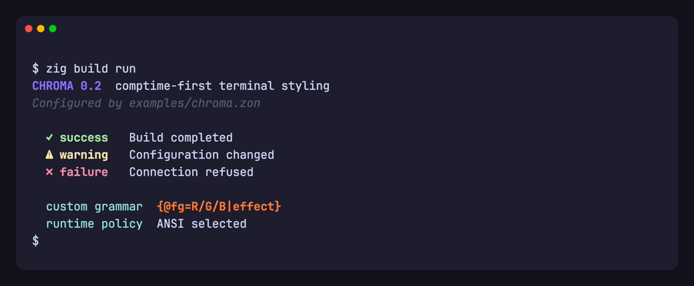

# Chroma

[](https://github.com/adia-dev/chroma-zig/actions/workflows/zig_test.yml)
[](https://ziglang.org/)
[](LICENSE)

Chroma is a comptime-first ANSI color and terminal text styling library for
Zig. It turns namespaced directives such as `{#bold,red}` into constant escape
sequences while leaving Zig fields such as `{s}` and `{d}` untouched. It is
designed for colorful CLI tools, console applications, and logs without
runtime parsing or allocation.



This image is captured from the real `zig build run` output and can be
regenerated with [`docs/chroma.tape`](docs/chroma.tape) using
[VHS](https://github.com/charmbracelet/vhs).

## Features

- Formatting is parsed, validated, and rendered at compile time.
- ANSI and plain variants are constants; terminal selection requires only a
  runtime branch.
- Standard, bright, 256-color, and 24-bit RGB colors are supported for both
  foregrounds and backgrounds.
- Typed ZON themes provide reusable semantic styles and configurable grammar
  characters without runtime file I/O.
- Unknown Chroma directives and malformed color values fail with focused
  compile-time diagnostics.
- Terminal detection honors `NO_COLOR`, `CLICOLOR_FORCE`, redirected output,
  and Windows virtual-terminal support.

## Installation

Add the package to `build.zig.zon`:

```sh
zig fetch --save=chroma https://github.com/adia-dev/chroma-zig/archive/refs/tags/v0.2.0.tar.gz
```

Import Chroma's module in `build.zig`:

```zig
const chroma_dep = b.dependency("chroma", .{
    .target = target,
    .optimize = optimize,
});
exe.root_module.addImport("chroma", chroma_dep.module("chroma"));
```

Chroma is a Zig module rather than a runtime library, so there is no library
artifact to link.

## Runnable configurable example

The repository includes a complete consumer-style example:

- [`examples/main.zig`](examples/main.zig) binds and uses a formatter.
- [`examples/chroma.zon`](examples/chroma.zon) defines semantic styles and
  changes the grammar to forms such as `{@failure|bold}` and
  `{@fg=255/120/50}`.

Run it with:

```sh
zig build run
```

Set `NO_COLOR=1` to see the same example using its precomputed plain variant.

## What happens at comptime?

Chroma keeps parsing and configuration out of the runtime path. Environment
and terminal capability cannot be known until the program runs, so those
decisions remain deliberately small and explicit.

| Operation | Phase | Runtime allocation or parsing? |
| --- | --- | --- |
| Import typed `chroma.zon` configuration | Comptime | No |
| Validate syntax, style names, colors, and RGB channels | Comptime | No |
| Parse Chroma directives | Comptime | No |
| Generate exact-size ANSI and plain format strings | Comptime | No |
| Validate Zig format fields through `std.fmt` | Comptime | No |
| Read `NO_COLOR` and `CLICOLOR_FORCE` | Runtime, opt-in | No allocation |
| Detect TTY and enable Windows virtual-terminal processing | Runtime, opt-in | No allocation |
| Select the ANSI or plain constant | Runtime | One boolean branch |
| Substitute `{s}`, `{d}`, and other Zig arguments | Runtime | Handled by `std.fmt` |
| Write bytes to the output stream | Runtime | Handled by the application |

## Basic use

```zig
const std = @import("std");
const chroma = @import("chroma");

pub fn main() void {
    std.debug.print(
        chroma.format("{#bold,red}Failed:{#reset} {s}\n"),
        .{"connection refused"},
    );
}
```

Chroma reserves only fields beginning with the configured marker (`#` by
default). Other fields are preserved for `std.fmt`:

```zig
const fmt = chroma.format("{{literal}} {#green}{s: >12} {d}");
```

The doubled braces also remain doubled in `fmt`; `std.fmt` performs the final
brace unescaping when it consumes the format string.

## Directive reference

Default directives use `{#item,item}`. Items in the same directive are applied
left to right, with later foreground and background colors taking precedence.
Chroma emits one combined SGR sequence for the resulting directive.

```zig
chroma.format("{#red}standard red");
chroma.format("{#bright-blue,bold}bright blue");
chroma.format("{#fg:cyan,bg:bright-magenta}named colors");
chroma.format("{#fg:120,bg:231}indexed colors");
chroma.format("{#fg:255;100;0,bg:20;24;32}true color");
chroma.format("{#reset}all defaults");
chroma.format("{#fg:default,bg:default}default colors");
```

The basic color names are `black`, `red`, `green`, `yellow`, `blue`,
`magenta`, `cyan`, and `white`. Prefix any of them with `bright-` for the bright
variant.

Effects are `bold`, `dim`, `italic`, `underline`, `blink`, `reverse`, `hidden`,
and `strikethrough`. Disable them with `normal-intensity`, `no-italic`,
`no-underline`, `no-blink`, `no-reverse`, `no-hidden`, and
`no-strikethrough`. `normal-intensity` disables both bold and dim, matching SGR
code 22.

An automatic final reset is emitted only if a Chroma style remains active. Set
`Config.auto_reset` to `false` when style continuation is intentional.

## Compile-time themes

Place a typed ZON file beside the Zig source that imports it. For example,
`chroma.zon`:

```zig
.{
    .styles = .{
        .{
            .name = "error",
            .style = .{
                .foreground = .{ .rgb = .{ .r = 220, .g = 50, .b = 47 } },
                .effects = .{ .bold, .underline },
            },
        },
        .{
            .name = "notice",
            .style = .{
                .foreground = .{ .bright = .cyan },
                .background = .{ .indexed = 236 },
            },
        },
    },
}
```

Bind it once to an explicit formatter type:

```zig
const chroma = @import("chroma");
const ui = chroma.Formatter(@import("chroma.zon"));

const failure = ui.format("{#error}Could not open {s}");
const notice = ui.format("{#notice}Listening on port {d}");
```

A named style can set a foreground, background, and any number of effects.
Omitted fields leave the existing state unchanged. Names must begin with an
ASCII letter, may contain letters, digits, `-`, and `_`, and cannot shadow a
built-in directive.

Themes can also customize the grammar inside the fixed braces:

```zig
.{
    .syntax = .{
        .marker = '@',
        .item_separator = '|',
        .value_separator = '=',
        .channel_separator = '/',
    },
    .styles = .{
        .{
            .name = "error",
            .style = .{
                .foreground = .{ .rgb = .{ .r = 220, .g = 50, .b = 47 } },
            },
        },
    },
}
```

That formatter accepts `{@error|bold}` and `{@fg=255/100/0}`. Syntax
characters must be distinct ASCII punctuation characters other than `{` and
`}`. This keeps Chroma fields separate from ordinary `std.fmt` fields.

## ANSI and plain output

`render` generates both variants at compile time:

```zig
const message = comptime chroma.render("{#red}failure:{#reset} {s}\n");

if (use_color) {
    try writer.print(message.ansi, .{reason});
} else {
    try writer.print(message.plain, .{reason});
}
```

Keep the explicit branch when the string contains Zig formatting fields,
because `Writer.print` requires its format argument to remain comptime-known.
For strings without fields, `message.select(use_color)` can be passed to
`writer.writeAll`.

The optional detector keeps environment and platform work out of the renderer:

```zig
const use_color = try chroma.terminal.detect(
    init.io,
    init.minimal.environ,
    std.Io.File.stdout(),
    .auto,
);
```

Policies are `.auto`, `.always`, and `.never`. Automatic mode applies
`NO_COLOR`, then `CLICOLOR_FORCE`, then asks Zig whether ANSI is supported. The
same call enables Windows virtual-terminal processing when available. No
allocator is required.

## Migration from 0.1

Version 0.2 deliberately namespaces Chroma directives so Zig format fields are
never guessed from a list of known colors.

| Chroma 0.1 | Chroma 0.2 |
| --- | --- |
| `{red}` | `{#red}` |
| `{bold,red}` | `{#bold,red}` |
| `{fg:120}` | `{#fg:120}` |
| `{255;100;0}` | `{#fg:255;100;0}` |
| `{bgRed}` | `{#bg:red}` |
| `{reset}` | `{#reset}` |

Unknown `{#...}` directives now fail at compile time. Non-namespaced fields,
including all `std.fmt` fields, pass through unchanged.

## Development

Use Zig 0.16.0:

```sh
zig build
zig build run
zig build test
time zig build benchmark
zig fmt --check .
```

The test step includes normal unit tests, a large comptime stress case, and
fixtures which must fail compilation with the expected diagnostic. CI runs the
suite natively on Linux, macOS, and Windows and performs additional cross-target
builds.

## License

[MIT](./LICENSE)
